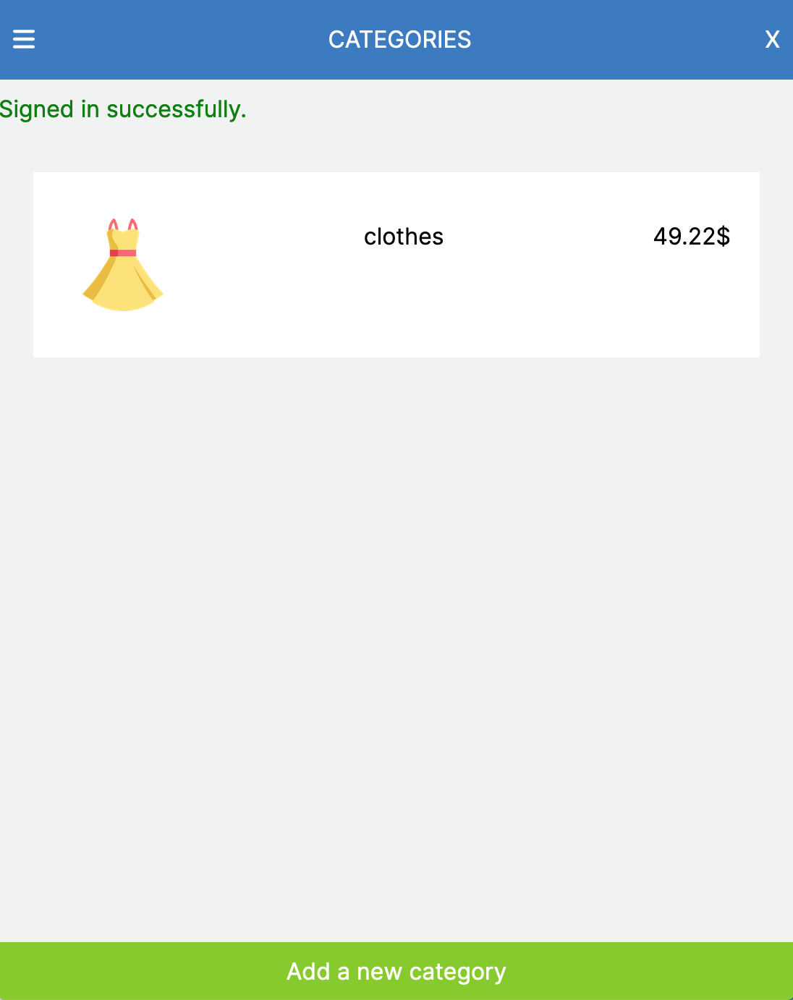

# Budget Recipe App

## Description

> The Budget app is a mobile web application where you can manage your budget: you have a list of transactions associated with a category, so that you can see how much money you spent and on what.

## Screenshot



## Demo

[Live Demo Link](https://powerful-everglades-80437.herokuapp.com/)

[Loom](https://loom.com/share/17446fca91a94de3948adc5a9ba1eda5)

## Built With

- Ruby on Rails
- Postgres

## Getting Started

### Get a local copy

- git clone the project

```bash
git clone https://github.com/jaflih/budget_app.git
```

```
cd budget_app
```

### Install the app

```
bundle install
rails db:migrate
```

### Run the app

- To run the app

```
rails s
```

```
Visit http://localhost:3000/ in your browser.
```

### Run the tests

- To run the tests

```
rspec spec/models
rspec spec/views
rspec spec/requests
rspec spec/routing/
```

## Authors

👤 **Jaflih**

- GitHub: [@githubhandle](https://github.com/jaflih)
- LinkedIn: [LinkedIn](https://www.linkedin.com/in/jaflih/)

## 🤝 Contributing

Contributions, issues, and feature requests are welcome!

Feel free to check the [issues page](../../issues/).

## Show your support

Give a ⭐️ if you like this project!

## Acknowledgments

- [Template by minimmmal](https://www.behance.net/gallery/19759151/Snapscan-iOs-design-and-branding?tracking_source=)
- Microverse
- Inspiration
- etc

## 📝 License

This project is [MIT](./MIT.md) licensed.
